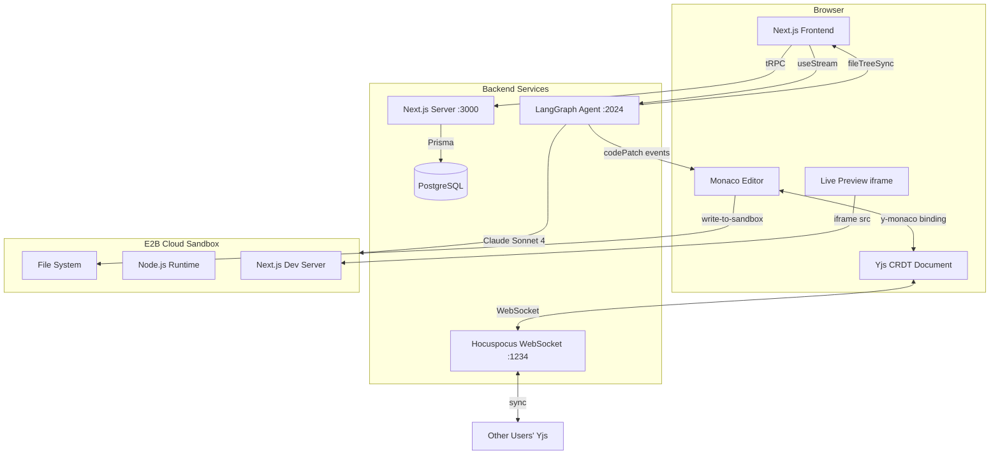
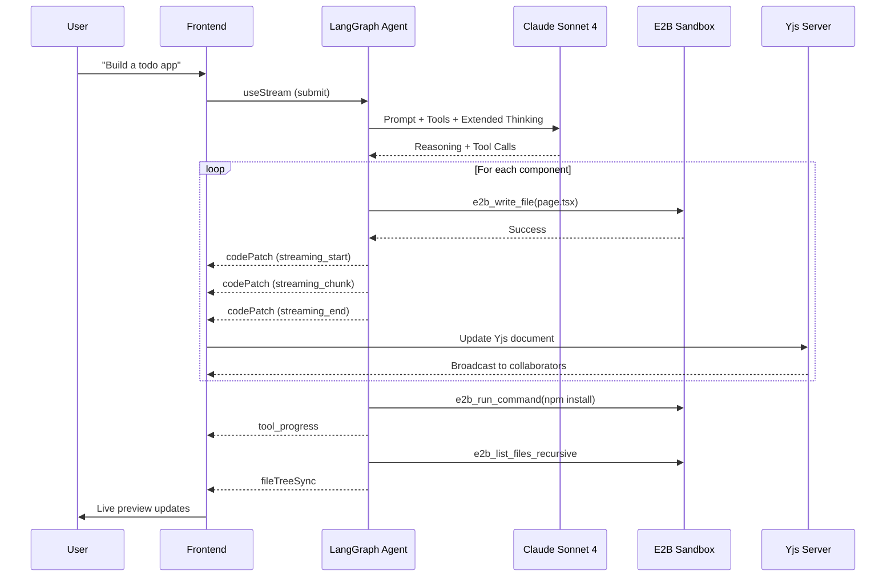
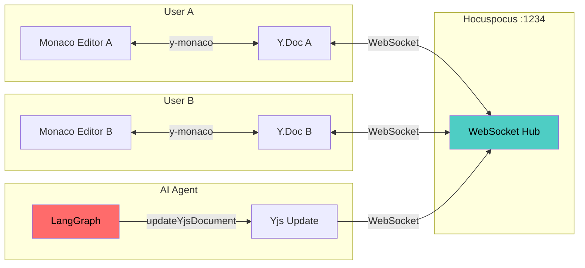
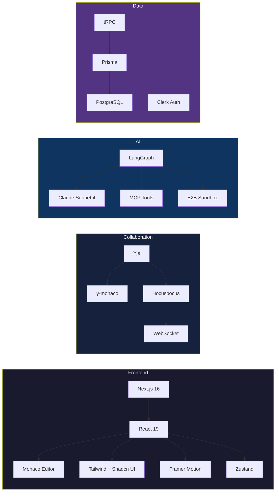

<div align="center">

# CodeVibe

### Describe it. Watch it build. Ship it.

An open-source AI-powered collaborative code editor that turns natural language into production-ready Next.js apps — in real time.

[](LICENSE)
[](https://nextjs.org)
[](https://typescriptlang.org)
[](https://anthropic.com)

</div>

---

## The Idea

You type **"build me a personal finance tracker with charts and a dark theme."**

Then you watch. The AI reasons through the architecture, writes each component one by one, installs packages, handles errors, and spins up a live preview — all streaming in real time across three synced panels. Other users can join your session and edit alongside you.

## How It Works

```
1. Describe  →  Type what you want in plain English
2. Watch     →  AI builds it file-by-file with live preview
3. Collaborate → Others join via shared link, edit together
4. Iterate   →  Ask for changes, AI fixes/adds in real time
```

## Architecture

### System Overview



### AI Agent Flow



### Real-Time Collaboration



## Features

| Feature | Description |
|---------|-------------|
| **AI Code Generation** | Claude Sonnet 4 with extended thinking builds full Next.js apps from prompts |
| **Live Preview** | Sandboxed app running in E2B with hot reload as code is written |
| **Real-Time Collab** | Yjs CRDTs + Hocuspocus — cursor presence, conflict-free merging |
| **Streaming Editor** | Code appears character-by-character with auto-scroll |
| **Session Sharing** | One link to invite collaborators into your session |
| **Tool Transparency** | Every file write, shell command, and decision visible in chat |
| **Mobile Ready** | Tab-based interface (Chat / Code / Preview) for mobile |
| **MCP Integration** | Playwright + Next.js Docs via Model Context Protocol |

## Tech Stack



## Getting Started

### Prerequisites

- Node.js 21+
- PostgreSQL
- API keys: `E2B_API_KEY`, `CLERK_SECRET_KEY`, Anthropic (via LangGraph)

### Setup

```bash
git clone https://github.com/kaifcoder/codevibe.git
cd codevibe
npm install
npx prisma migrate dev
```

### Environment Variables

```env
DATABASE_URL=postgresql://...
E2B_API_KEY=...
NEXT_PUBLIC_CLERK_PUBLISHABLE_KEY=...
CLERK_SECRET_KEY=...
NEXT_PUBLIC_WS_URL=ws://localhost:1234         # optional
NEXT_PUBLIC_LANGGRAPH_URL=http://localhost:2024  # optional
```

### Run (3 terminals)

```bash
npm run dev      # Next.js        → localhost:3000
npm run agent    # LangGraph      → localhost:2024
npm run yjs      # Collaboration  → localhost:1234
```

### Other Commands

```bash
npm run build                        # Production build
npm run lint                         # ESLint
npx prisma studio                    # Database GUI (localhost:5555)
npx prisma migrate dev --name <name> # New migration
```

## Project Structure

```
src/
├── app/                         # Next.js App Router
│   ├── chat/[id]/page.tsx       # Main editor interface
│   ├── api/sync-filesystem/     # E2B → Frontend file sync
│   ├── api/write-to-sandbox/    # Editor → E2B write
│   └── api/session/[token]/     # Session CRUD
├── lib/
│   ├── agent.ts                 # LangGraph agent definition
│   ├── e2b-tools.ts             # Sandbox tools (6 tools)
│   ├── nextjs-agent-prompt.ts   # Agent system prompt
│   ├── mcp-client.ts            # MCP tool integration
│   └── collaboration/           # Yjs + Hocuspocus setup
├── hooks/
│   ├── use-agent-stream.ts      # useStream + custom event handling
│   └── use-collaboration.ts     # Yjs session per file
├── components/                  # React UI components
├── stores/chat-store.ts         # Zustand state
└── trpc/                        # tRPC routers and client
```

## Agent Toolbelt

| Tool | What it does |
|------|-------------|
| `e2b_write_file` | Create/overwrite files (streams progressively to editor) |
| `e2b_read_file` | Read file contents from sandbox |
| `e2b_run_command` | Execute shell commands (npm install, etc.) |
| `e2b_list_files` | List directory contents |
| `e2b_list_files_recursive` | Full project tree with filtering |
| `e2b_delete_file` | Remove files/directories |
| **Playwright MCP** | Browser automation and testing |
| **Next.js Docs MCP** | Official documentation lookup |

## Contributing

Contributions welcome! Fork the repo, check [open issues](https://github.com/kaifcoder/codevibe/issues), and submit a PR.

## License

[MIT](LICENSE)

---

<div align="center">

Built by [@kaifcoder](https://github.com/kaifcoder)

**Star this repo if you find it useful!**

</div>
